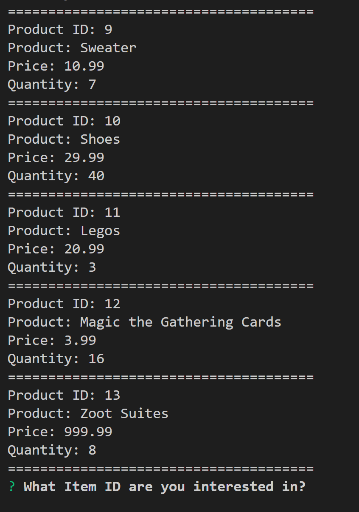
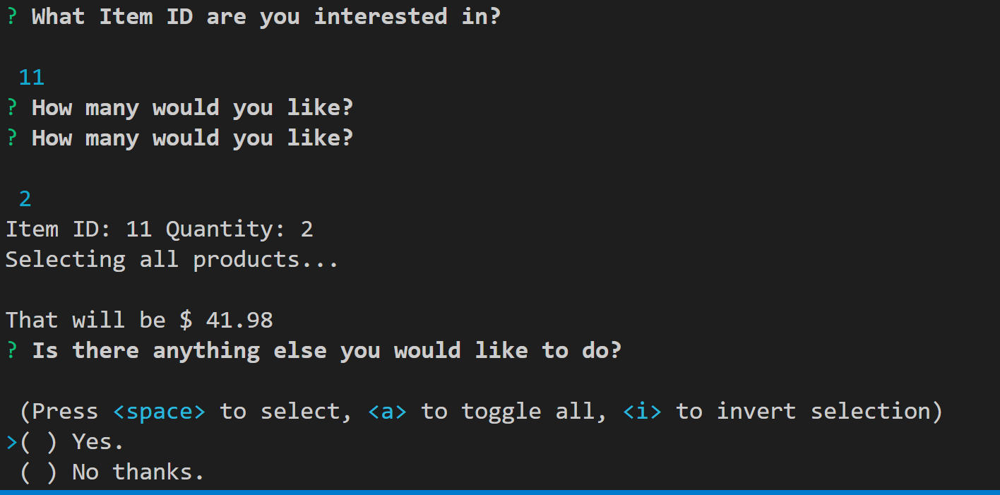
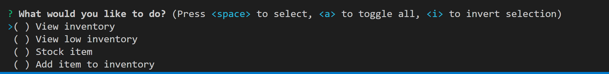

# bamizon-cli

 This is a storefront-like CLI using node.js

## There are two interfaces:
    - bamizon.js
      - This CLI is for the customer side
    - bamizonManager.js
      - This CLI is for the store owner.

Above is the interface for bamizon.js.

You must order by item ID.

This is the manager selection page.
Here you can:
  1. View inventory
  2. View Low inventory
  3. Add inventory to items by id
  4. add a new item to the store

  ## You must have these NPMs installed:
  1. inquirer
  2. mysql

  You can install these by running for example "npm install inquirer -S" in your terminal
